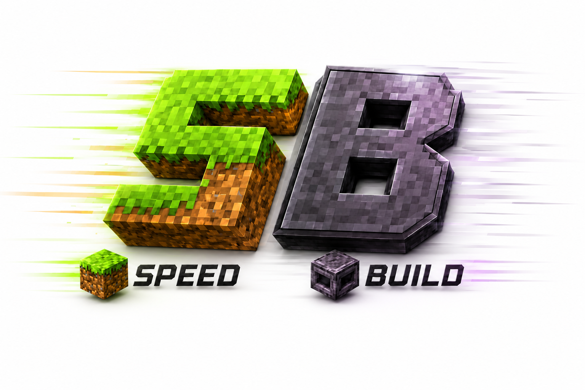
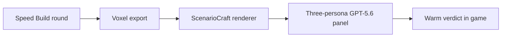

# ScenarioCraft

<p align="center">
  <a href="https://agorokh.github.io/scenariocraft/">
    
  </a><br>
  <strong><a href="https://agorokh.github.io/scenariocraft/">How to Play Speed Build</a></strong>
</p>

ScenarioCraft turns our kids' game ideas into playable family rituals: they invent a scenario,
we shape it into a spec together, an AI coding agent builds it, and an AI panel referees the
match while we play. Speed Build is reference scenario #1, not the product. The product is
the repeatable, kid-legible, parent-guidable, agent-buildable, warmly judged loop that can
welcome whatever scenario comes up in the car next week.

**Codex built this repository from [public GitHub issues](https://github.com/agorokh/scenariocraft/issues); GPT-5.6 [referees every round](judge/src/main/java/io/github/agorokh/scenariocraft/judge/OpenAiPersonaJudge.java).**

> **NOT AN OFFICIAL MINECRAFT PRODUCT. NOT APPROVED BY OR ASSOCIATED WITH MOJANG OR
> MICROSOFT.**

## The co-creators

- A 7-year-old brainstormer and judge auditor.
- A 10-year-old game designer, logo author, and judge auditor.
- A 17-year-old contributing engineer working in his own Codex sessions.
- Their dad, facilitating the build and playing every round.

Their design feedback is product input. Relevant choices are recorded as “Decisions by the
design council” without publishing any child's name.

## Decisions by the design council

- The 10-year-old game designer, logo designer, and UX lead renamed the first scenario from
  Build Battle to **Speed Build**.
- The council kept controls in chat, titles, and bossbars so Java and Bedrock players hear the
  same story; there is no inventory-menu UI.
- The three judge personas share [one rubric](judge/rubric.md), and the panel
  [fails closed below quorum](judge/src/main/java/io/github/agorokh/scenariocraft/judge/JudgeCouncil.java).

## First scenario: Speed Build

Contestants receive a secret build prompt, create in private plots, tour the finished builds,
and hear a warm three-persona AI panel score every entry against one shared rubric.

The playable Paper round, voxel renderer, GPT-5.6 judge CLI, in-game verdict path, and local
Docker demo are all in this repository and covered by the build and real-server smoke checks.

## Quickstart

Prerequisites are Docker with Compose, GNU Make, `curl`, and Python 3.10 or newer. On macOS,
install Java 21 as well (for example, `brew install openjdk@21`) so Geyser can bind directly
to the Mac's LAN interface.

1. **Clone**

   `git clone https://github.com/agorokh/scenariocraft.git && cd scenariocraft`

2. **Start the local server**

   `export OPENAI_API_KEY='<your OpenAI API key>'`

   `make family-up`

3. **Play on Java or Bedrock**

   - Java 1.21.x: join `localhost:25565`.
   - Bedrock on an iPad, phone, or computer: add the Docker host's LAN IP with port `19132`.
   - Xbox with a macOS host on the same LAN: open the Friends tab and join ScenarioCraft
     family demo when it appears under LAN Games.

   Run `/speedbuild start` in chat. `/battle` and `/bb` remain available for existing servers.

Want the one-minute tour first? [See how to play Speed Build](https://agorokh.github.io/scenariocraft/#step-1), then return here for the canonical commands.

The demo uses Paper 1.21.11 with repository-owned Geyser, Floodgate, and ViaVersion setup. It
publishes Java TCP `25565` and Bedrock UDP `19132`, and is intended only for a trusted local
network. The family configuration gives builders 10 minutes and uses the complete prompt deck.
On Linux, Geyser runs in Paper's container. On macOS, where Colima and some Docker Desktop
setups do not make container UDP discoverable to Xbox/iPad clients, `make family-up`
automatically runs Geyser as a host LaunchAgent. It downloads pinned Geyser Standalone
2.11.0 build 1201, verifies its committed checksum, synchronizes and compares Floodgate's
key with Paper, and probes UDP
`19132` before reporting that the server is ready. There is no manual key-copy step.
Paper and the judge use Docker's `unless-stopped` restart policy; the macOS Geyser LaunchAgent
also restarts automatically. Run `make family-status` to check both Compose and the real
Bedrock listener, or `make family-down` to stop the family server cleanly.
RCON stays inside the Compose network and uses a generated password. With one human player,
solo mode automatically fills the second plot from the bundled sample rocket so the full
render, judge, and chat-verdict path still runs. See [the demo runbook](demo/README.md) for
headless verification and cleanup details.

Missing `OPENAI_API_KEY` stops startup immediately with an instruction to export it; the key
is passed from the shell environment and is never stored in the Compose file or image.

## One household, every device

Different kids can bring an iPad, Windows Bedrock client, or Java PC to one kid-safe Speed
Build server that still feels like a real online game. The same secret prompt, timers, and
warm AI panel judge every build the same way, whatever device its builder uses. The family
startup command adds the verified Linux Bedrock overlay and, on macOS, the host-networked
Geyser service needed for Xbox LAN discovery. See the [demo runbook](demo/README.md) for the
implementation and its platform limits.

### Xbox/iPad troubleshooting

- On macOS, always use `make family-up`, not a direct `docker compose up`; the Make target
  is what installs the LAN-facing Geyser service and synchronizes Floodgate authentication.
- Allow Java to accept incoming network connections if macOS displays a firewall prompt.
- Keep the Mac, Xbox, and iPad on the same trusted LAN. Guest Wi-Fi and access-point client
  isolation prevent Xbox LAN discovery even when the server is healthy.
- `make family-status` must end with `Bedrock UDP 19132 answered a RakNet discovery probe.`
  If it does not, inspect `.local/geyser/geyser.log` and run
  `docker compose --project-name scenariocraft -f docker-compose.yml -f docker-compose.bedrock.yml logs paper judge`
  before starting a round.
- Rerun `make family-up` after deleting Docker volumes or regenerating Floodgate data; it
  resynchronizes the key automatically. Do not copy the key by hand or run another Geyser
  process on UDP `19132`.

## How it works



The [round exporter](src/main/java/io/github/agorokh/scenariocraft/buildbattle/RoundExportService.java)
writes the build evidence, the [renderer](renderer/) makes the views, and the
[judge CLI](judge/) applies the committed personas and shared rubric before the plugin
announces the result.

## Publishing the How to Play page

The `Deploy Pages` workflow uploads the literal `site/` directory. Repository Settings must
keep **Pages > Build and deployment > Source** set to **GitHub Actions**, and the
`github-pages` environment must allow Pages deployments. If deployment reports `Get Pages
site failed` or a 404, restore those settings and rerun the workflow.

## Speed Build operator notes

During an active Speed Build, ScenarioCraft protects the entire configured
`battle_world`: it contains explosions, pistons, dispensers, fire, fluid flow, block fading
and leaf decay, decorative-entity interactions, and entity-driven/block-form changes until
the controller returns to `IDLE`.
During plot entry and BUILDING, contestant teleports are accepted only inside their assigned
boundary, and non-contestant teleports into private plots are rejected
(controller-owned phase moves are tracked explicitly). The plugin logs one
activation message when each round starts. Keep unrelated builds and minigames in a
different world.

`wall-height` must leave one additional block above the concrete wall for the
anti-peek roof: `floor Y + wall-height + 1` must be below the battle world's
exclusive maximum height. If an older configuration is now too tall, startup
reports the configured value, calculated roof Y, world maximum, and minimum
reduction.

Controller-owned moves use explicit-world console teleports and verify the result on the
server, including bounded confirmation after 1, 5, and 20 total ticks for chunk-loading or
lifecycle delays. Startup and round start check that the exact `minecraft:execute` and
`minecraft:tp` registrations remain available without teleporting players as a health probe;
every relocation checks again before production dispatch, and CI executes the full command
path on real Paper. Keep both exact namespaced commands available in server configuration.
A failed
move logs `SCENARIOCRAFT_TELEPORT_FAILURE` and alerts every online operator. Run
`/speedbuild stop`, move the named player safely if needed, and have them reconnect. Rejoin
retries a confirmed hub return; a successful recovery is logged and clears temporary
containment only after the hub arrival and player data are saved. An atomic plugin-owned
registry under the ScenarioCraft data folder retains pending player UUIDs even when a
player-data save fails, so enable and rejoin rediscover the recovery after a restart. Verify
that the player is at the hub with the default world border and can drop/pick up items before
starting the next round. Operators who join while recovery is pending receive another alert.
To inspect the durable queue, read
`plugins/ScenarioCraft/pending-teleport-recovery.txt`; it contains one pending player UUID per
line. Do not manually remove an entry: reconnect that player and let ScenarioCraft clear the
entry only after it confirms the hub arrival and saves the player data. If the entry remains,
keep the player contained and use the persistence alert's exception in the server log to fix
the underlying storage problem before reconnecting them again. The registry requires a data
folder filesystem that supports same-directory atomic moves; unsupported storage fails closed
at enable. Runtime registry writes emit `SCENARIOCRAFT_RECOVERY_REGISTRY_FAILURE` with the
registry path, distinct from player-data `SCENARIOCRAFT_RECOVERY_PERSISTENCE_FAILURE`, rather
than weakening the atomic-write guarantee. An operator command may move a pending player only
to the configured hub; the controller supervises that arrival and performs the same saved,
atomic clear sequence.
If enable fails with `Could not load teleport recovery registry`, stop the server and back up
the registry before editing it. Correct any malformed line to a UUID; move the file aside only
after verifying that no listed player is still mid-recovery, then restart and confirm every
affected player is safely at the hub.

Alerts are also sent to the server console and to online players with the
`scenariocraft.alerts` permission, which defaults to operators.

Judge output is read from timestamped directories under
`plugins/ScenarioCraft/rounds/`. During REVEAL, the plugin checks for a newly atomically
published `results.txt` at the configured `results-poll-ticks` interval and announces its
winner through titles, compact chat lines, and winner-plot particles. The judge can request
the same deduplicated announcement over RCON; if RCON is down, the file poll remains the local
fallback. Players can use `/speedbuild results` to replay the latest result, including after the
round leaves REVEAL. Malformed, oversized, symbolic-link, or raw-JSON input is rejected with a
friendly message rather than displayed.

## Judge regression evals

The eval runner requires Python 3.10 or newer. Run the deterministic recorded-response suite
used by CI from the repository root:

```sh
./evals/run.sh --dry-run --allow-synthetic-only
```

`--allow-synthetic-only` is an explicit transitional mode for the committed synthetic suite; it
does not satisfy issue #13's release evidence. `make evals-release` omits that exception and fails
closed unless at least two checksum-bound family cases and their council reviews are present.

Each directory under `evals/cases/` contains a schema-v1 `voxels.json`, `task.txt`,
`recorded-response.json`, and an assertion-based `expected.yml`. Synthetic edge cases identify
their responses as hand-authored production-schema goldens; family-round cases must identify an
exact live recording by round, plot, artifact commit, repository artifact paths, and SHA-256.
The runner reads both artifacts from the cited commit and verifies their hashes. The `.yml` files use the
JSON-compatible subset of YAML so CI needs no extra parser package. Assertions cover score bands,
cross-case ordering, banned phrasing, the production result schema, calculated mean, and
reasoning-before-score field order. The production Java validator owns persona-YAML parsing,
kid-safe concrete praise, sentence structure, and configured-panel validation so the eval runner
cannot drift from the judge contract.

For a live GPT-5.6 pass, provide the API key only through the process environment and omit
`--dry-run`; the runner first rebuilds the installed judge from the current checkout:

```sh
export OPENAI_API_KEY='<your OpenAI API key>'
./evals/run.sh --allow-synthetic-only
```

Live mode creates an isolated one-plot round for each fixture, uses the production renderer,
personas, rubric, moderation, and judge, and never overwrites the committed recorded responses.
It strips RCON configuration and uses a temporary config directory, so eval verdicts cannot be
announced to a live server. The runner prints a pass/fail table and exits non-zero when any
assertion fails.

A rejected console dispatch is retried once before it is treated as a failure. If saving a
player-data recovery marker or the plugin-owned registry fails, the console and online
operators receive a separate persistence alert; keep the player contained and have them
reconnect so the hub return and durable clear are retried. The server console is the durable
on-call signal when no privileged player is online: monitor for
`SCENARIOCRAFT_TELEPORT_FAILURE`, `SCENARIOCRAFT_RECOVERY_PERSISTENCE_FAILURE`, and
`SCENARIOCRAFT_RECOVERY_REGISTRY_FAILURE`, then follow the recovery steps above before starting
another round. Startup logs `SCENARIOCRAFT_PENDING_RECOVERY_COUNT` with the registry path
whenever persisted recoveries are waiting; each one resumes when that player rejoins.

## How this was built

ScenarioCraft is being built in the open for **OpenAI Build Week (July 2026)**. Every change
starts from a [GitHub issue](https://github.com/agorokh/scenariocraft/issues), is implemented
by Codex, and lands through a pull request carrying its Codex session receipt. The public
[delivery procedure](.agents/skills/deliver/SKILL.md), living [agent guide](AGENTS.md), and
[ExecPlans](docs/plans/) make the decisions and the failures inspectable instead of hiding
them behind the final code.

Codex accelerated the project by turning the council's written rules into small, tested
vertical slices: Paper gameplay, the voxel contract and renderer, the GPT-5.6 judge, the
Docker demo, and this page. The review loop caught concrete problems before merge. For
example, review of the How to Play page found that its logo worked only in the deployment
workflow and broke local preview; the fix and the reason are preserved in the
[page ExecPlan](docs/plans/pages-how-to-play.md). Every PR is reviewed against
[the same P1 policy](code_review.md). The independently delivered
[judge eval suite](evals/) remains auditable in its owning [PR #40](https://github.com/agorokh/scenariocraft/pull/40)
rather than being presented as work from this submission-story PR.

The engineering discipline used here was not invented for Build Week. It is a public port of
a privately evolved, multi-model agentic engineering system: pitfall ledgers, decision logs,
eval gates, and session handoffs. ScenarioCraft is the first public project built with that
method and Codex as its sole software builder. A larger private family-AI system with companion
players exists, but it is not part of this entry and no code was copied from it.

## License

ScenarioCraft is available under the [MIT License](LICENSE).
